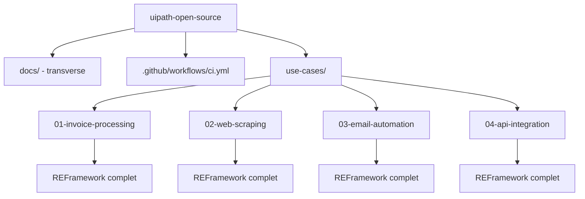

# Architecture du projet

## Pourquoi un monorepo multi-processus ?

Plutot que de creer 4 depots GitHub separes, ce projet regroupe les 4 cas d'usage dans **un seul depot**, chaque module restant un **projet UiPath autonome** (son propre `project.json`, son propre REFramework, sa propre configuration). Avantages pour un projet open source pedagogique :

- Une seule documentation transverse (contribution, licence, code de conduite)
- Une seule pipeline CI, appliquee a chaque module via une strategie matricielle
- Facilite la comparaison entre cas d'usage pour les contributeurs qui apprennent
- Historique Git unifie, plus simple a maintenir pour un mainteneur unique

Chaque module reste independant : on peut le deplacer vers son propre depot plus tard sans rien casser.

## Schema global



## Ce qui est partage entre modules

| Element | Partage ? | Detail |
|---|---|---|
| Licence, Code de conduite, Contribution | Oui | Un seul jeu de fichiers a la racine |
| Pipeline CI | Oui (matrice) | Un seul `ci.yml`, execute pour chaque module |
| REFramework (structure Init/Process/End) | Non | Chaque module a sa propre copie, adaptee a son processus |
| Config.xlsx | Non | Propre a chaque module (colonnes differentes selon le processus) |
| Logging / gestion des exceptions | Convention commune | Meme structure de log (Info/Warn/Error), implementation propre a chaque module |

## Convention REFramework appliquee a chaque module

Chaque module suit la meme architecture interne :

```
src/
├── Main.xaml                  # Point d'entree, orchestre les 4 etats
├── Framework/
│   ├── InitAllSettings.xaml
│   ├── GetTransactionData.xaml
│   ├── Process.xaml           # Logique metier specifique au module
│   ├── SetTransactionStatus.xaml
│   └── EndProcess.xaml
└── Config/
    └── Config.xlsx            # Chemins, seuils, credentials (via Assets Orchestrator)
```

- **Business Exception** : erreur metier previsible (ex. facture illisible, e-mail sans piece jointe attendue) → transaction marquee en echec, traitement continue
- **System Exception** : erreur technique (ex. site web inaccessible, API en timeout) → retry automatique puis arret si echec persistant

## Orchestrator (optionnel)

Les 4 modules peuvent tourner en local via UiPath Studio (mode debug) sans Orchestrator. Pour une demonstration complete (Queues, Assets, planification), un compte **UiPath Orchestrator Community Cloud** (gratuit) est recommande.
