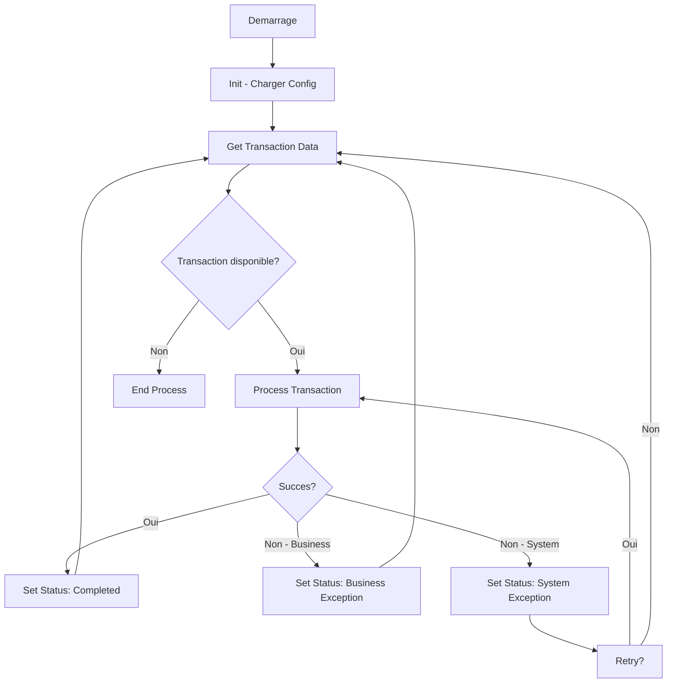
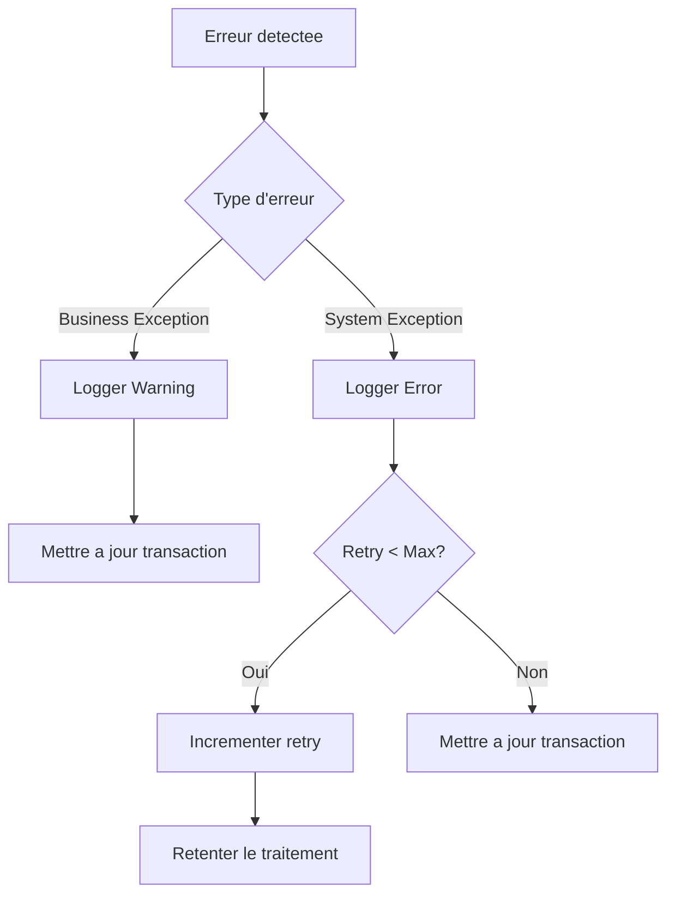

# Solution Design Document (SDD)

## Informations generales

| Champ | Valeur |
|-------|--------|
| **Nom du projet** | UiPath Open Source |
| **Version** | 1.0 |
| **Date** | 2026 |
| **Auteur** | [Votre nom] |
| **Lien PDD** | [PDD.md](PDD.md) |

## Architecture technique

### Architecture REFramework

Le projet utilise le **Robotic Enterprise Framework (REFramework)** d'UiPath :

```
Init (InitAllSettings.xaml)
    ↓
Get Transaction Data (GetTransactionData.xaml)
    ↓
Process Transaction (Process.xaml)
    ↓ (si error)
Set Transaction Status (SetTransactionStatus.xaml)
    ↓
End Process (EndProcess.xaml)
```

### Composants

| Composant | Role | Fichier |
|-----------|------|---------|
| Init | Chargement de la configuration | `InitAllSettings.xaml` |
| GetTransactionData | Recuperation des transactions | `GetTransactionData.xaml` |
| Process | Traitement d'une transaction | `Process.xaml` |
| SetTransactionStatus | Mise a jour du statut | `SetTransactionStatus.xaml` |
| EndProcess | Nettoyage et fermeture | `EndProcess.xaml` |

## Flux de traitement

### Flux principal



### Flux de gestion des erreurs



## Configuration

### Fichier Config.xlsx

| Sheet | Colonnes | Description |
|-------|----------|-------------|
| Config | Key, Value | Parametres generaux |
| Credentials | Name, Store, Credential | Identifiants Orchestrator |
| Queues | Name, Folder | Files d'attente |
| Settings | Key, Value, DefaultValue | Parametres divers |

### Assets Orchestrator

| Asset | Type | Usage |
|-------|------|-------|
| `ConfigPath` | String | Chemin vers Config.xlsx |
| `LogPath` | String | Chemin des fichiers de log |
| `MaxRetry` | Integer | Nombre max de tentatives |

## Structure du code

```
src/
├── Main.xaml                    # Point d'entrée
├── Framework/
│   ├── InitAllSettings.xaml     # Chargement configuration
│   ├── GetTransactionData.xaml  # Extraction transactions
│   ├── Process.xaml             # Logique métier
│   ├── SetTransactionStatus.xaml # Mise a jour statut
│   └── EndProcess.xaml          # Fermeture
└── Config/
    └── Config.xlsx              # Configuration centralisee
```

## Dependances

### Packages UiPath

| Package | Version | Usage |
|---------|---------|-------|
| UiPath.Workflow | >= 23.10 | Core activities |
| UiPath.Excel.Activities | >= 2.22 | Manipulation Excel |
| UiPath.WebAPI.Activities | >= 1.6 | Appels API |

### Connecteurs

| Connecteur | Usage |
|------------|-------|
| Orchestrator | Assets, Queues, Logging |
| API REST | Integration metier (a adapter) |

## Securite

- **Credentials** : Stockes dans Orchestrator Assets (jamais en dur)
- **Donnees** : Aucune donnee sensible dans le repo
- **Logs** : Pas d'informations sensibles dans les logs
- **Packages** : Dependencies verifiees via NuGet

## Scalabilite

- **Queue System** : Pour le traitement parallele
- **Configurabilite** : Parametres extrenalises
- **Modularite** : Workflows composites reutilisables

## Monitoring

- **Orchestrator** : Dashboards et alertes
- **Logs** : Niveaux Info/Warn/Error
- **Metrics** : Temps de traitement, taux de succes
