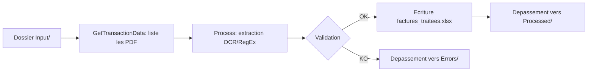

# Module 01 — Traitement de factures

Automatisation de la lecture de factures fournisseurs recues au format PDF/Excel, l'extraction des donnees cles, leur validation, et leur enregistrement dans un fichier de suivi.

## Description

Ce module extrait les informations clés d'une facture (numero, fournisseur, date, montants) et valide la coherence des montants (HT/TTC/TVA). Les factures traitees sont deplacees vers `Processed/` ou `Errors/`.

## Pre-requis

- UiPath Studio 2024.10+
- Packages : `UiPath.PDF.Activities`, `UiPath.Excel.Activities`, `UiPath.System.Activities`
- Optionnel : `UiPath.IntelligentOCR.Activities` pour PDF scannes

## Configuration

Editer `src/Config/Config.xlsx` :

| Onglet | Parametres |
|--------|-----------|
| Settings | InputFolder, ProcessedFolder, ErrorsFolder, OutputFile, MontantSeuilVerification, ToleranceTVA |
| Constants | Timeout OCR, Nombre de tentatives (retry) |

## Utilisation

1. Deposer les factures PDF dans le dossier `Input/` (chemin defini dans Config.xlsx)
2. Lancer le workflow depuis UiPath Studio (F5)
3. Consulter le fichier `factures_traitees.xlsx` genere

## Flux de traitement

## Documentation

- [PDD — Process Definition Document](docs/PDD.md)
- [SDD — Solution Design Document](docs/SDD.md)
