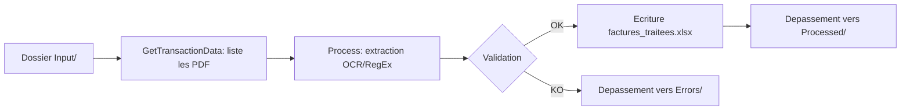
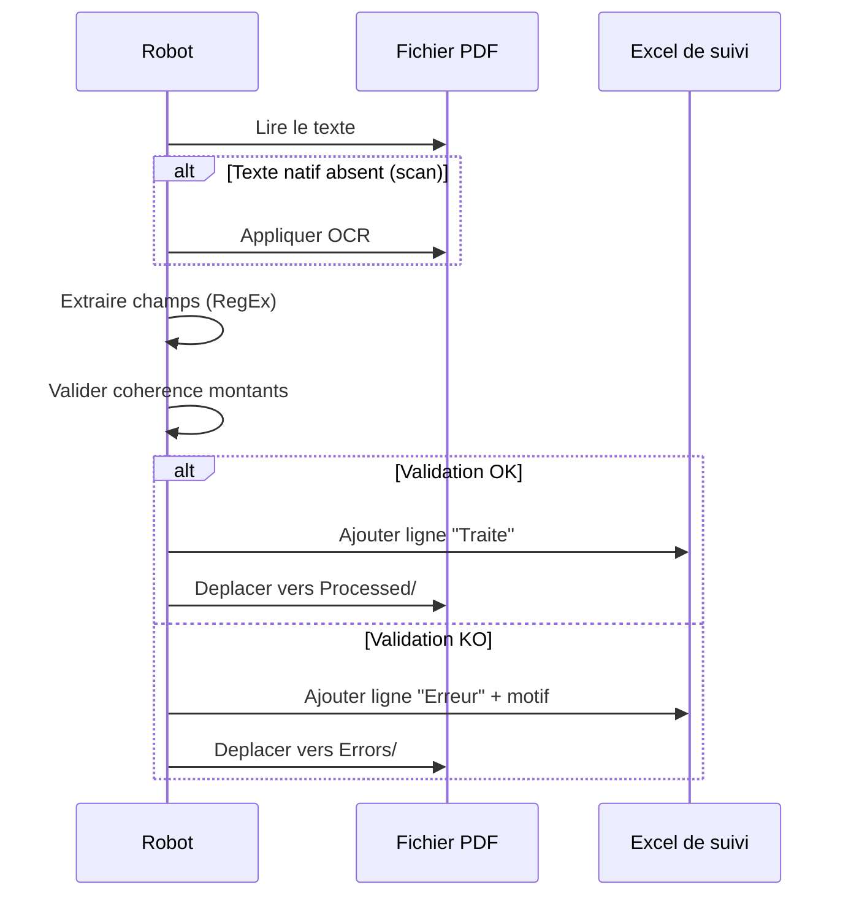

# Solution Design Document — Traitement de factures

## 1. Architecture technique

## 2. Packages UiPath utilises

- `UiPath.PDF.Activities` — lecture et extraction de texte PDF
- `UiPath.IntelligentOCR.Activities` (optionnel, pour PDF scannes) — OCR
- `UiPath.Excel.Activities` — ecriture du fichier de suivi
- `UiPath.System.Activities` — gestion fichiers/dossiers

## 3. Structure REFramework adaptee

- **InitAllSettings** : lit `Config.xlsx`, cree les dossiers `Processed/` et `Errors/` s'ils n'existent pas
- **GetTransactionData** : liste les fichiers PDF de `Input/`, un fichier = une transaction
- **Process** :
  1. Extraire le texte du PDF (natif ou OCR selon detection)
  2. Appliquer les expressions regulieres pour isoler numero, date, montants
  3. Valider la coherence des montants
  4. Ecrire la ligne dans `factures_traitees.xlsx`
  5. Deplacer le fichier selon le resultat
- **SetTransactionStatus** : marque Success / Business Exception / System Exception
- **EndProcess** : genere un resume (nb factures traitees / en erreur) et log final

## 4. Structure de `Config.xlsx`

| Onglet | Colonnes |
|---|---|
| Settings | InputFolder, ProcessedFolder, ErrorsFolder, OutputFile, MontantSeuilVerification, ToleranceTVA |
| Constants | Timeout OCR, Nombre de tentatives (retry) |
| Assets | (vide en local — utiliser Orchestrator Assets en production) |

## 5. Gestion des exceptions

- Toute exception metier (`BusinessRuleException`) est catchee dans `Process.xaml`, journalisee avec le nom du fichier, et n'interrompt pas la boucle principale
- Toute exception systeme (`Exception` generique liee a l'acces fichier) declenche le mecanisme de retry natif du REFramework (`MaxRetryNumber` dans Config)

## 6. Diagramme de flux detaille (Process.xaml)

