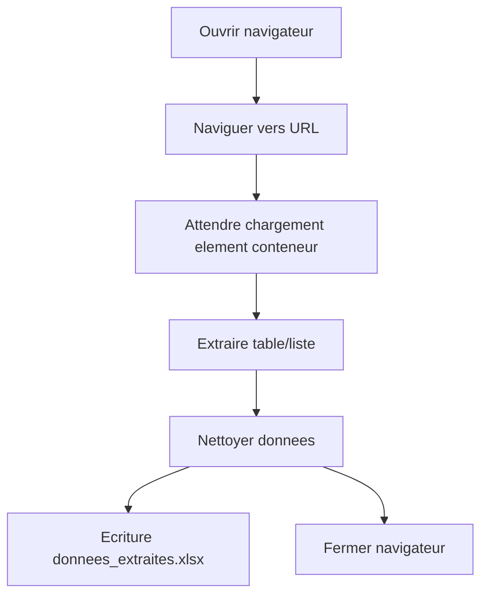

# Module 02 — Web Scraping

Automatisation de l'extraction periodique de donnees publiques depuis un site web et export structuré au format Excel.

## Description

Ce module navigue vers une URL cible (site public), extrait une table ou liste de donnees (ex. taux de change, offres d'emploi), nettoie les donnees et genere un fichier `donnees_extraites.xlsx` avec horodatage.

## Pre-requis

- UiPath Studio 2024.10+
- Packages : `UiPath.Web.Activities`, `UiPath.System.Activities`

## Configuration

Editer `src/Config/Config.xlsx` :

| Onglet | Parametres |
|--------|-----------|
| Settings | TargetURL, SelectorPrincipal, OutputFile, MaxRetries |
| Constants | TimeoutNavigation, WaitForElementSeconds |

## Utilisation

1. Definir l'URL cible dans `Config.xlsx`
2. Lancer le workflow depuis UiPath Studio (F5)
3. Consulter le fichier `donnees_extraites.xlsx` genere

## Flux de traitement

## Documentation

- [PDD — Process Definition Document](docs/PDD.md)
- [SDD — Solution Design Document](docs/SDD.md)
