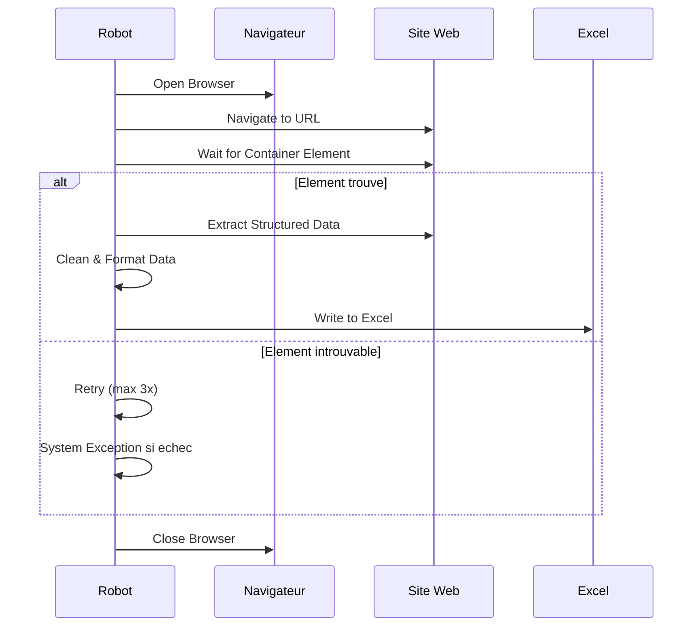

# Solution Design Document — Web Scraping

## 1. Architecture technique

## 2. Packages UiPath utilises

- `UiPath.Web.Activities` — Open Browser, Data Scraping, Extract Structured Data
- `UiPath.System.Activities` — File I/O, Logging, Retry Scope
- `UiPath.Excel.Activities` — Ecriture Excel

## 3. Structure REFramework

- **InitAllSettings** : lit `Config.xlsx`, verifie l'accessibilite de l'URL
- **GetTransactionData** : prepare la transaction (URL, selecteurs)
- **Process** :
  1. Ouvrir le navigateur (Chrome/Edge)
  2. Naviguer vers l'URL cible
  3. Attendre le chargement de l'element conteneur (attente explicite)
  4. Extraire les donnees via Data Scraping
  5. Nettoyer et formater les donnees
  6. Ecrire dans Excel avec horodatage
  7. Fermer le navigateur
- **SetTransactionStatus** : SUCCESS si extraction reussie, SYSTEM_EXCEPTION si echec
- **EndProcess** : log du resume (nb lignes extraites)

## 4. Structure de `Config.xlsx`

| Onglet | Key | Value |
|--------|-----|-------|
| Settings | TargetURL | https://example.com/data |
| Settings | SelectorPrincipal | `<html><body><table>...` |
| Settings | OutputFile | C:\donnees_extraites.xlsx |
| Settings | MaxRetries | 3 |
| Constants | TimeoutNavigation | 30 |
| Constants | WaitForElementSeconds | 10 |

## 5. Gestion des exceptions

- **Selecteur introuvable** : Retry 3 fois avec attente exponentielle (5s, 10s, 20s), puis System Exception si echec
- **Ligne invalide** : Ignoree, warning journalise, traitement continue
- **Site inaccessible** : Retry 2 fois, puis System Exception

## 6. Diagramme de flux detaille

