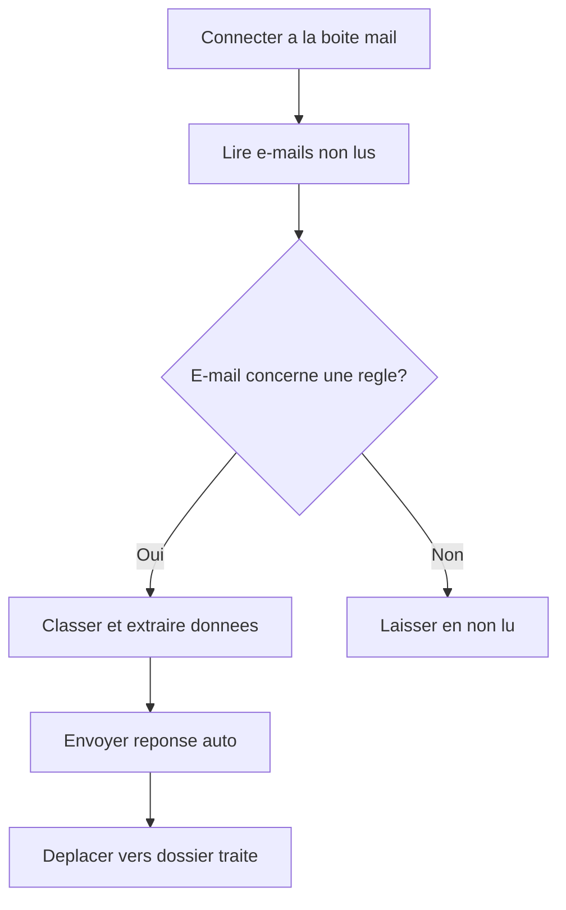

# Module 03 — Automatisation e-mails

Automatisation du tri, de la classification et de la reponse automatique a des e-mails entrants.

## Description

Ce module connecte a une boite mail (IMAP ou Outlook), lit les e-mails entrants, les classifie selon des regles metier (mot-cles, expediteur, presence de pieces jointes), et envoie des reponses automatiques预definies.

## Pre-requis

- UiPath Studio 2024.10+
- Packages : `UiPath.Mail.Activities`, `UiPath.System.Activities`
- Compte IMAP/SMTP ou Outlook configure

## Configuration

Editer `src/Config/Config.xlsx` :

| Onglet | Parametres |
|--------|-----------|
| Settings | MailServer, Port, UseSSL, Username, OutputFolder |
| Rules | SubjectKeywords, SenderFilters, AutoReplyTemplate |

## Flux de traitement

## Documentation

- [PDD — Process Definition Document](docs/PDD.md)
- [SDD — Solution Design Document](docs/SDD.md)
