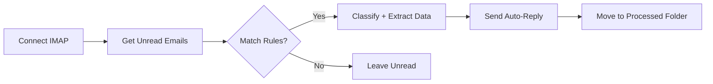

# Solution Design Document — Automatisation e-mails

## 1. Architecture technique

## 2. Packages UiPath utilises

- `UiPath.Mail.Activities` — Get Mail Messages, Send Mail Message
- `UiPath.System.Activities` — File I/O, Logging

## 3. Structure REFramework

- **InitAllSettings** : lit Config.xlsx, etablit la connexion mail
- **GetTransactionData** : recupere les e-mails non lus
- **Process** :
  1. Lire l'e-mail (objet, expediteur, corps, pieces jointes)
  2. Appliquer les regles de classification
  3. Envoyer reponse automatique si applicable
  4. Deplacer l'e-mail vers le dossier traite
- **SetTransactionStatus** : SUCCESS/BUSINESS_EXCEPTION/SYSTEM_EXCEPTION
- **EndProcess** : log du resume (nb e-mails traites)

## 4. Structure de `Config.xlsx`

| Onglet | Key | Value |
|--------|-----|-------|
| Settings | MailServer | imap.example.com |
| Settings | Port | 993 |
| Settings | UseSSL | True |
| Settings | OutputFolder | C:\EmailLogs\ |
| Rules | SubjectKeywords | facture, urgence, demande |
| Rules | AutoReplyTemplate | Merci pour votre message... |

## 5. Gestion des exceptions

- **E-mail sans objet** : Business Exception, ignore, traitement continue
- **Serveur inaccessible** : System Exception, retry 3 fois
- **Erreur envoi reponse** : Warning, e-mail deplace quand meme
