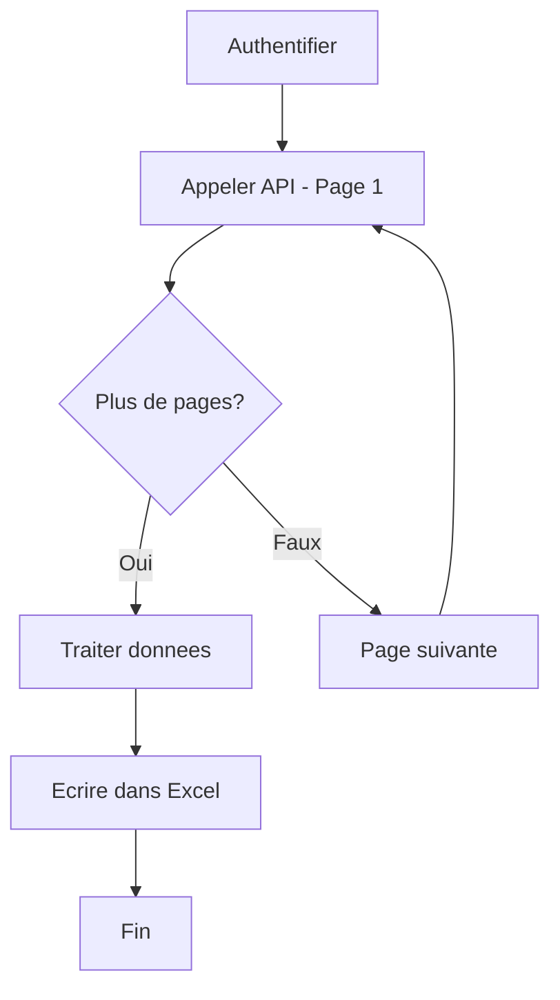

# Module 04 — Integration API

Synchronisation de donnees entre une API externe et un systeme interne via des appels REST.

## Description

Ce module appelle une API REST externe (ex. API publique de donnees), gere l'authentification (API Key/OAuth), la pagination, les retries, et synchronise les donnees dans un fichier Excel ou une base de donnees locale.

## Pre-requis

- UiPath Studio 2024.10+
- Packages : `UiPath.WebAPI.Activities`, `UiPath.Excel.Activities`, `UiPath.System.Activities`

## Configuration

Editer `src/Config/Config.xlsx` :

| Onglet | Parametres |
|--------|-----------|
| Settings | BaseURL, APIKey, OutputFile, PageSize |
| Auth | AuthType, TokenEndpoint, ClientID |
| Retry | MaxRetries, TimeoutSeconds |

## Flux de traitement

## Documentation

- [PDD — Process Definition Document](docs/PDD.md)
- [SDD — Solution Design Document](docs/SDD.md)
