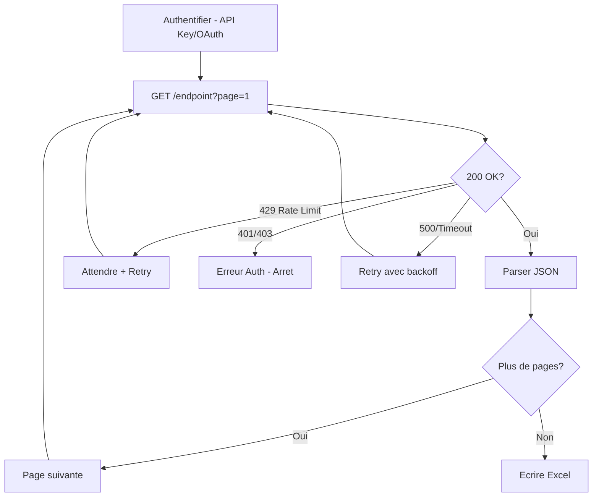
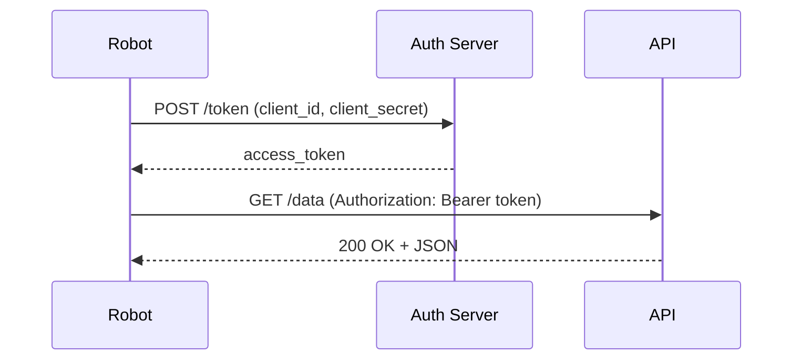

# Solution Design Document — Integration API

## 1. Architecture technique

## 2. Packages UiPath utilises

- `UiPath.WebAPI.Activities` — HTTP Request, HTTP Activity
- `UiPath.Excel.Activities` — Ecriture Excel
- `UiPath.System.Activities` — Logging, Retry Scope, deserialization JSON

## 3. Structure REFramework

- **InitAllSettings** : lit Config.xlsx, valide la configuration API
- **GetTransactionData** : gere la pagination (page courante, token suivant)
- **Process** :
  1. Construire la requete HTTP (headers, parametres)
  2. Envoyer la requete avec retry
  3. Parser la reponse JSON
  4. Extraire et valider les enregistrements
  5. Accumuler les donnees
- **SetTransactionStatus** : SUCCESS/BUSINESS_EXCEPTION/SYSTEM_EXCEPTION
- **EndProcess** : ecriture dans Excel, log du resume

## 4. Structure de `Config.xlsx`

| Onglet | Key | Value |
|--------|-----|-------|
| Settings | BaseURL | https://api.example.com/v1 |
| Settings | Endpoint | /data |
| Settings | PageSize | 100 |
| Settings | OutputFile | C:\api_data.xlsx |
| Auth | AuthType | APIKey (ou OAuth2) |
| Auth | APIKey | (via Orchestrator Asset) |
| Auth | TokenEndpoint | https://auth.example.com/token |
| Retry | MaxRetries | 3 |
| Retry | TimeoutSeconds | 30 |

## 5. Gestion des exceptions

- **429 Rate Limit** : attendre `Retry-After` header, puis retry
- **401/403** : System Exception, arret immediat
- **500/Timeout** : retry avec backoff exponentiel (5s, 15s, 45s)
- **JSON invalide** : System Exception, arret
- **Enregistrement incomplet** : Business Exception, ignore

## 6. Sequence d'authentification OAuth2

